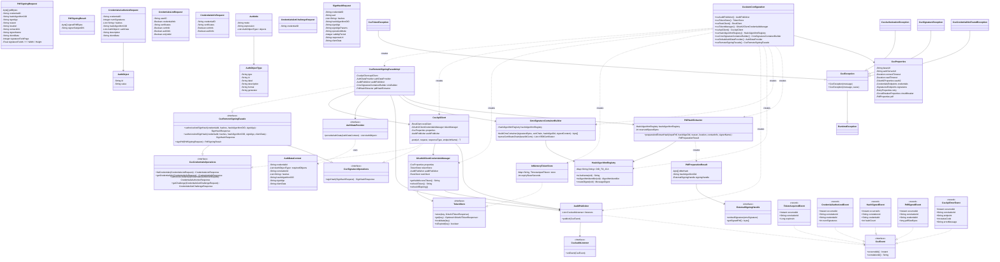

# OpenCSC Class Diagram

```mermaid
classDiagram
    direction TB

    %% ════════════════════════════════════════════
    %% API Layer (public interfaces)
    %% ════════════════════════════════════════════

    class CscCredentialsOperations {
        <<interface>>
        +listCredentials(CredentialsListRequest) CredentialsListResponse
        +getCredentialInfo(CredentialsInfoRequest) CredentialsInfoResponse
        +authorizeCredential(CredentialsAuthorizeRequest) CredentialsAuthorizeResponse
        +getChallenge(CredentialsGetChallengeRequest) CredentialsGetChallengeResponse
    }

    class CscSignatureOperations {
        <<interface>>
        +signHash(SignHashRequest) SignHashResponse
    }

    class CscRemoteSigningFacade {
        <<interface>>
        +authorizeAndSignHash(credentialId, hashes, hashAlgorithmOID, signAlgo) SignHashResponse
        +authorizeAndSignHash(credentialId, hashes, hashAlgorithmOID, signAlgo, clientData) SignHashResponse
        +signPdf(PdfSigningRequest) PdfSigningResult
    }

    CscRemoteSigningFacade --|> CscCredentialsOperations
    CscRemoteSigningFacade --|> CscSignatureOperations

    %% ════════════════════════════════════════════
    %% Facade Implementation
    %% ════════════════════════════════════════════

    class CscRemoteSigningFacadeImpl {
        -CscApiClient apiClient
        -AuthDataProvider authDataProvider
        -AuditPublisher auditPublisher
        -CmsSignatureContainerBuilder cmsBuilder
        -PdfHashExtractor pdfHashExtractor
    }

    CscRemoteSigningFacadeImpl ..|> CscRemoteSigningFacade
    CscRemoteSigningFacadeImpl --> CscApiClient
    CscRemoteSigningFacadeImpl --> AuthDataProvider
    CscRemoteSigningFacadeImpl --> AuditPublisher
    CscRemoteSigningFacadeImpl --> CmsSignatureContainerBuilder
    CscRemoteSigningFacadeImpl --> PdfHashExtractor

    %% ════════════════════════════════════════════
    %% API Client
    %% ════════════════════════════════════════════

    class CscApiClient {
        -RestClient restClient
        -OAuth2ClientCredentialsManager tokenManager
        -CscProperties properties
        -AuditPublisher auditPublisher
        -post(url, request, responseType, endpointName) T
    }

    CscApiClient ..|> CscCredentialsOperations
    CscApiClient ..|> CscSignatureOperations
    CscApiClient --> OAuth2ClientCredentialsManager
    CscApiClient --> AuditPublisher

    %% ════════════════════════════════════════════
    %% OAuth2 Token Management
    %% ════════════════════════════════════════════

    class TokenStore {
        <<interface>>
        +store(key, OAuth2TokenResponse)
        +get(key) Optional~OAuth2TokenResponse~
        +invalidate(key)
        +isExpired(key) boolean
    }

    class InMemoryTokenStore {
        -Map~String, TimestampedToken~ store
        -int expirySkewSeconds
    }

    InMemoryTokenStore ..|> TokenStore

    class OAuth2ClientCredentialsManager {
        -CscProperties properties
        -TokenStore tokenStore
        -AuditPublisher auditPublisher
        -RestClient restClient
        +getValidAccessToken() String
        +refreshToken() String
        +refreshIfExpiring()
    }

    OAuth2ClientCredentialsManager --> TokenStore
    OAuth2ClientCredentialsManager --> AuditPublisher

    %% ════════════════════════════════════════════
    %% Crypto
    %% ════════════════════════════════════════════

    class HashAlgorithmRegistry {
        -Map~String,String~ OID_TO_JCA
        +toJcaName(oid) String
        +toAlgorithmIdentifier(oid) AlgorithmIdentifier
        +createDigest(oid) MessageDigest
    }

    class CmsSignatureContainerBuilder {
        -HashAlgorithmRegistry hashAlgorithmRegistry
        +buildCmsContainer(signatureBytes, certChain, hashAlgoOid, signedContent) byte[]
        +parseCertificateChain(base64Certs) List~X509Certificate~
    }

    CmsSignatureContainerBuilder --> HashAlgorithmRegistry

    %% ════════════════════════════════════════════
    %% PDF
    %% ════════════════════════════════════════════

    class PdfHashExtractor {
        -HashAlgorithmRegistry hashAlgorithmRegistry
        -int reservedSpaceBytes
        +prepareAndExtractHash(inputPdf, hashAlgoOid, reason, location, contactInfo, signerName) PdfPreparationResult
    }

    PdfHashExtractor --> HashAlgorithmRegistry

    class PdfPreparationResult {
        -byte[] dtbsHash
        -String hashAlgorithmOid
        -ExternalSigningHandle signingHandle
    }

    class ExternalSigningHandle {
        <<interface>>
        +embedSignature(cmsSignature)
        +getSignedPdf() byte[]
    }

    PdfPreparationResult --> ExternalSigningHandle
    PdfHashExtractor ..> PdfPreparationResult : creates

    class PdfSigningRequest {
        -byte[] pdfBytes
        -String credentialID
        -String hashAlgorithmOID
        -String signAlgo
        -String reason
        -String location
        -String contactInfo
        -String signerName
        -String clientData
        -Integer signatureFieldPage
        -Float signatureFieldX / Y / Width / Height
    }

    class PdfSigningResult {
        -byte[] signedPdfBytes
        -String signerSubjectDN
    }

    %% ════════════════════════════════════════════
    %% SPI (Extension Points)
    %% ════════════════════════════════════════════

    class AuthDataContext {
        -String credentialId
        -List~AuthObjectType~ requiredObjects
        -String correlationId
        -List~String~ hashes
        -String hashAlgorithmOID
        -String signAlgo
        -String clientData
    }

    class AuthDataProvider {
        <<interface>>
        +provideAuthData(AuthDataContext) List~AuthObject~
    }

    AuthDataProvider ..> AuthDataContext : uses

    class CscEvent {
        <<interface>>
        +occurredAt() Instant
        +correlationId() String
    }

    class CscAuditListener {
        <<interface>>
        +onEvent(CscEvent)
    }

    class AuditPublisher {
        -List~CscAuditListener~ listeners
        +publish(CscEvent)
    }

    AuditPublisher --> CscAuditListener
    AuditPublisher ..> CscEvent

    class TokenAcquiredEvent {
        <<record>>
        +Instant occurredAt
        +String correlationId
        +Long expiresIn
    }

    class CredentialAuthorizedEvent {
        <<record>>
        +Instant occurredAt
        +String correlationId
        +String credentialId
        +int numSignatures
    }

    class HashSignedEvent {
        <<record>>
        +Instant occurredAt
        +String correlationId
        +String credentialId
        +int hashCount
    }

    class PdfSignedEvent {
        <<record>>
        +Instant occurredAt
        +String correlationId
        +String credentialId
        +long pdfSizeBytes
    }

    class CscApiErrorEvent {
        <<record>>
        +Instant occurredAt
        +String correlationId
        +String endpoint
        +int statusCode
        +String errorMessage
    }

    TokenAcquiredEvent ..|> CscEvent
    CredentialAuthorizedEvent ..|> CscEvent
    HashSignedEvent ..|> CscEvent
    PdfSignedEvent ..|> CscEvent
    CscApiErrorEvent ..|> CscEvent

    %% ════════════════════════════════════════════
    %% Domain Models
    %% ════════════════════════════════════════════

    class AuthInfo {
        -String mode
        -String expression
        -List~AuthObjectType~ objects
    }

    class AuthObject {
        -String id
        -String value
    }

    class AuthObjectType {
        -String type
        -String id
        -String label
        -String description
        -String format
        -String generator
    }

    AuthInfo --> AuthObjectType

    %% ════════════════════════════════════════════
    %% Request / Response Models
    %% ════════════════════════════════════════════

    class CredentialsListRequest {
        -String userID
        -Boolean credentialInfo
        -String certificates
        -Boolean certInfo
        -Boolean authInfo
        -Boolean onlyValid
    }

    class CredentialsInfoRequest {
        -String credentialID
        -String certificates
        -Boolean certInfo
        -Boolean authInfo
    }

    class CredentialsAuthorizeRequest {
        -String credentialID
        -Integer numSignatures
        -List~String~ hashes
        -String hashAlgorithmOID
        -List~AuthObject~ authData
        -String description
        -String clientData
    }

    class CredentialsGetChallengeRequest {
        -String credentialID
    }

    class SignHashRequest {
        -String credentialID
        -String sad
        -List~String~ hashes
        -String hashAlgorithmOID
        -String signAlgo
        -String signAlgoParams
        -String operationMode
        -Integer validityPeriod
        -String responseUri
        -String clientData
    }

    CredentialsAuthorizeRequest --> AuthObject

    %% ════════════════════════════════════════════
    %% Exception Hierarchy
    %% ════════════════════════════════════════════

    class CscException {
        +CscException(message)
        +CscException(message, cause)
    }

    class CscTokenException
    class CscAuthorizationException
    class CscSignatureException
    class CscCredentialNotFoundException

    CscException --|> RuntimeException
    CscTokenException --|> CscException
    CscAuthorizationException --|> CscException
    CscSignatureException --|> CscException
    CscCredentialNotFoundException --|> CscException

    %% ════════════════════════════════════════════
    %% Auto-Configuration
    %% ════════════════════════════════════════════

    class CscAutoConfiguration {
        +cscAuditPublisher() AuditPublisher
        +cscTokenStore() TokenStore
        +cscRestClient() RestClient
        +cscTokenManager() OAuth2ClientCredentialsManager
        +cscApiClient() CscApiClient
        +cscHashAlgorithmRegistry() HashAlgorithmRegistry
        +cscCmsSignatureContainerBuilder() CmsSignatureContainerBuilder
        +cscDefaultAuthDataProvider() AuthDataProvider
        +cscRemoteSigningFacade() CscRemoteSigningFacade
    }

    class CscProperties {
        -String baseUrl
        -String authServerUrl
        -Duration connectTimeout
        -Duration readTimeout
        -OAuth2Properties oauth2
        -CredentialsEndpoints credentials
        -SignaturesEndpoints signatures
        -RetryProperties retry
        -CircuitBreakerProperties circuitBreaker
        -PdfProperties pdf
    }

    CscAutoConfiguration ..> CscRemoteSigningFacadeImpl : creates
    CscAutoConfiguration ..> CscApiClient : creates
    CscAutoConfiguration ..> OAuth2ClientCredentialsManager : creates
    CscAutoConfiguration ..> InMemoryTokenStore : creates
    CscAutoConfiguration ..> AuditPublisher : creates
    CscAutoConfiguration ..> HashAlgorithmRegistry : creates
    CscAutoConfiguration ..> CmsSignatureContainerBuilder : creates
    CscAutoConfiguration ..> PdfHashExtractor : creates
    CscAutoConfiguration --> CscProperties
```
